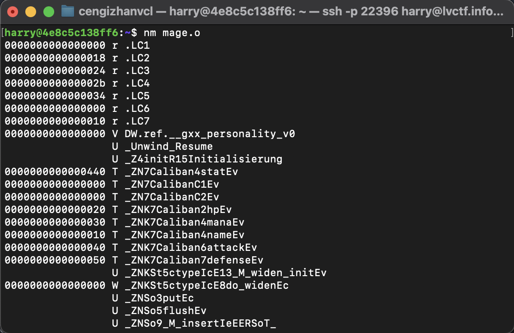
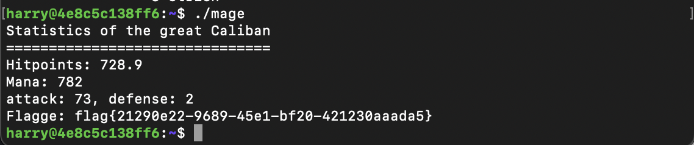
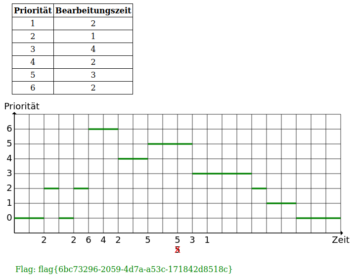
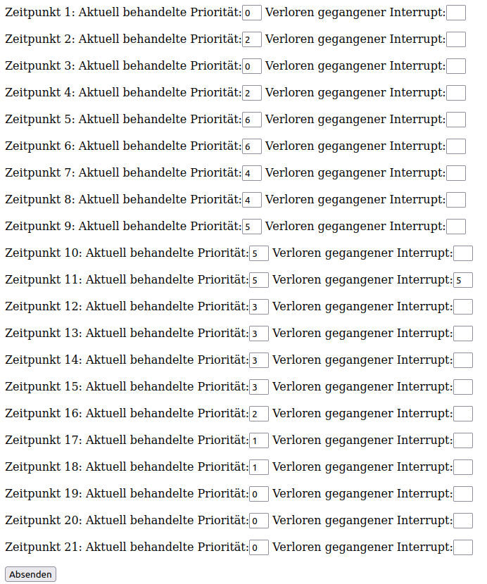
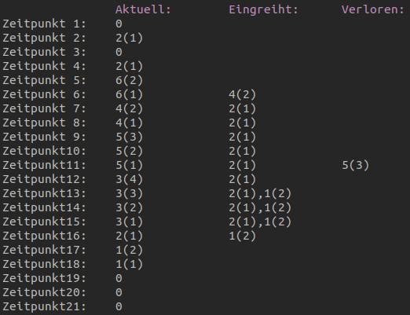
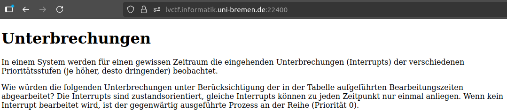

# Aufgabe 1

### a) Modul-Analyse mit nm (Funktion main)
Vorgehensweise: Die Objektdateien wurden mit dem Tool nm inspiziert, um die Symboltabelle zu prüfen. Symbole, die mit T (Text segment) markiert sind, sind in der jeweiligen Datei definiert.

Ergebnis:

| Modul | Relevanter Ausschnitt aus nm |
| -------- | -------- |
| stat.o     | 0000000000000000 T main    |
| mage.o     | (Enthält keine Definition von main)    |

Das Ergebnis von ```nm stat.o```:


### b) Analyse der Linker-Fehler (undefined reference)

Analyse: Die Fehlermeldungen entstehen, weil eine Funktion, die von mage.o benötigt wird, im Linkvorgang nicht gefunden wird. Die nm-Analyse von mage.o zeigte die folgende undefinierte Referenz (U):

$$\text{U \_Z4initR15Initialisierung}$$

Ursache: Dem Linker fehlt die Implementierung (Definition) der C++-Funktion:

$$\text{void init(Initialisierung \&)}$$

Dieses Modul muss separat erstellt und hinzugefügt werden.



### c) Erstellung des Moduls values.cc

Ableitung des Namens: Die Symboltabelle von mage.o zeigte Klassenmethoden, die auf den Namen Caliban hindeuten (z.B. _ZN7CalibanC1Ev, _ZN7Caliban4statEv).

Implementation in values.cc:

Basierend auf den Definitionen in defs.hh (Makros HP, MANA, ATTACK, DEFENSE) und dem abgeleiteten Namen "Caliban" wurde die Initialisierungsfunktion implementiert:

```c++
#include "defs.hh" 

void init(Initialisierung& data) {
    // Initialisierung der numerischen Felder mit den Werten aus defs.hh.
    data.hp = HP;
    data.mana = MANA;
    data.attack = ATTACK;
    data.defense = DEFENSE;
    
    // Setzen des Namens basierend auf der Symboltabelle
    data.name = "Caliban"; 
}
```

### d) Kompilieren, Linken und Ausführen des Programms

Ausgeführte Kommandos:

1. Kompilieren des neuen Moduls:
```bash
g++ -c values.cc -o values.o
```

2. Linken aller Module:
```bash
g++ mage.o stat.o values.o -o mage
```

3. Ausführen des Programms:
```bash
./mage
```

### Programmausgabe und Flagge:



### Gefundene Flagge:

$$\text{flag{21290e22-9689-45e1-bf20-421230aaada5}}$$

# Aufgabe 2
## a. Die Flagge & die Lösung




Wie in der Aufgabenstellung¹ erwähnt, sind Prozesse "zustandsorientiert" und gleiche Interrupts können zu einem Zeitpunkt nur einmal vorliegen. Daher wird der *zweite Interrupt mit der Priorität 5* vernachlässigt und geht *verloren*, denn zu jenem Zeitpunkt wird bereits ein Interrupt mit Priorität 5 bearbeitet. 
Einige Interrupts werden eingereiht, da höherwertig priorisierte Interrupts anstehen¹(*Priority Scheduling*) (je größer die Priorität desto dringlicher), dies wird hoffentlich in der folgenden Auflistung leicht ersichtlich:
(Die Bearbeitungsdauer wird in den Klammern angegegeben)



Kein *eingereihter* Interrupt meldet sich nochmal(bevor er fertig bearbeitet wird), daher geht auch kein *eingreihter* Interrupt verloren. 
Zum *Zeitpunkt 7* wird ein *Interrupt mit Priorität 2* eingereiht und dieser kann erst zum *Zeitpunkt 16* beabreitet werden, da bis dahin erst höherwertig priorisierte Interrupts bearbeitet werden. Zu *Zeitpunkt 13* meldet sich bereits der *Interrupt mit Priorität 1*, dieser muss sich aber aufgrund des *Interrupts mit Priorität 2* hinter diesem einreihen und bis *Zeitpunkt 17* gedulden.

### b) Ablauf

Der resultierende Ablauf ist zufriedenstellend, falls der verlorene Interrupt mit der Priorität 5 keine kritischen Informationen (auch ein Zeitstempel kann je nach Umstand kritisch sein) bearbeiten wollte. Da die Interrupts aber zustandsorientiert sind, also eine mehrfache gleichzeitige Einreihung nicht erlaubt ist, und diese Entscheidung wohl bewusst bei dem System getroffen wurde, lässt sich davon ausgehen, dass dieser verlorene Interrupt nicht kritisch war und so sogar Effizienz gewonnen wurde, sodass sich die Bearbeitung anderer Interrupts nicht noch weiter aufschieben konnte.  

## Literaturverzeichnis

1) OpenAI ChatGPT Chatverlauf (s. Anhang) (11.11.2025)
2) Aufgabenstellung der Challenge "Unterbrechungen" auf der CTF-Plattform der Uni-Bremen des Moduls TI2 WS25/26 10.11.25 (Screenshot siehe Anhang)

# Anhang

1) Chatverlauf mit [ChatGPT] (https://chat.openai.com/chat) am 04.11.2025:
Frage: Was macht nm Kommando in Unix
Weitere Frage: Kompilieren, Linken und Ausführen Kommandos

nm liest Objektdateien (.o), Bibliotheken (.a, .so) oder ausführbare Dateien und zeigt die Symboltabelle an — also alle Funktionen, Variablen, und deren Speicheradressen.


| Schritt                       | Befehl                    | Beschreibung                          |
| :---------------------------- | :------------------------ | :------------------------------------ |
| 1️⃣ Kompilieren               | `gcc -c file.c -o file.o` | Übersetzt in Objektdatei              |
| 2️⃣ Symbolanalyse             | `nm file.o`               | Zeigt Symbole (Funktionen, Variablen) |
| 3️⃣ Linken                    | `gcc file.o -o program`   | Erstellt ausführbare Datei            |
| 4️⃣ Prüfen der Abhängigkeiten | `ldd ./program`           | Zeigt benötigte Bibliotheken          |
| 5️⃣ Ausführen                 | `./program`               | Startet das Programm                  |
| 6️⃣ Debugging                 | `gdb ./program`           | Startet Debugger                      |


2)  



