# Aufgabe 1

## First-Fit

Beim First-Fit-Verfahren durchläuft die Speicherverwaltung die Liste der Reihe nach und alloziert den erstbesten freien Bereich, der groß genug ist.

- Der erste freie Platz liegt in I


- I hat noch genau genug Platz für B:
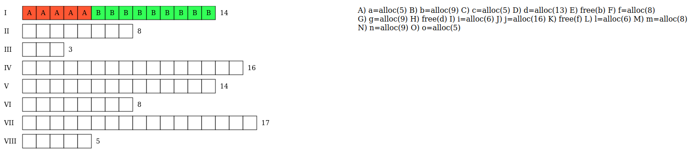

- Daher muss C in II:
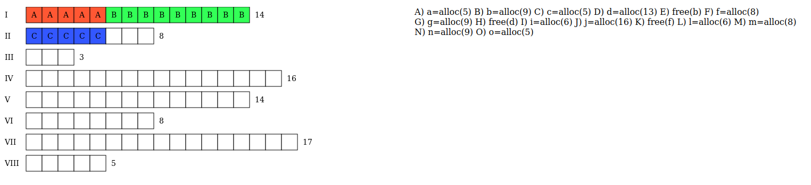

- D passt nicht in I (weil I voll ist),sondern erst wieder in IV
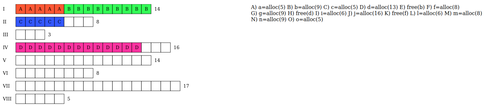

- B wird gelöscht:
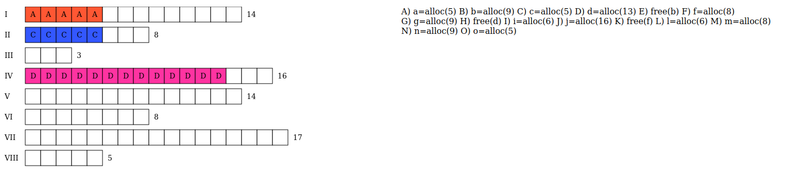

- Also gibt es PLatz für F:
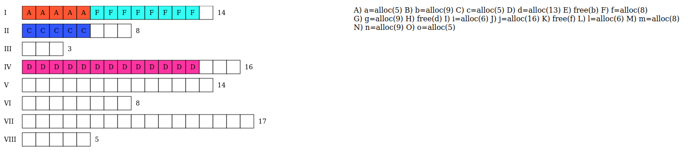

- G findet erst in V wieder Platz (die zu durchsuchende Liste startet ja immer mit I) :
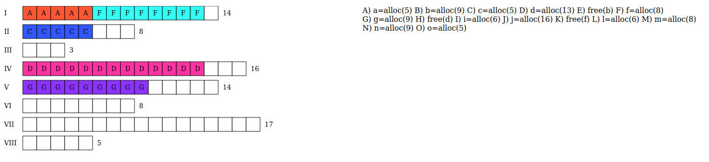

Leider konnte die Flag nicht gefunden werden, dennoch sollte die Lösung so aussehen und N konnte als einzige Operation kein Speicher zugewiesen werden:
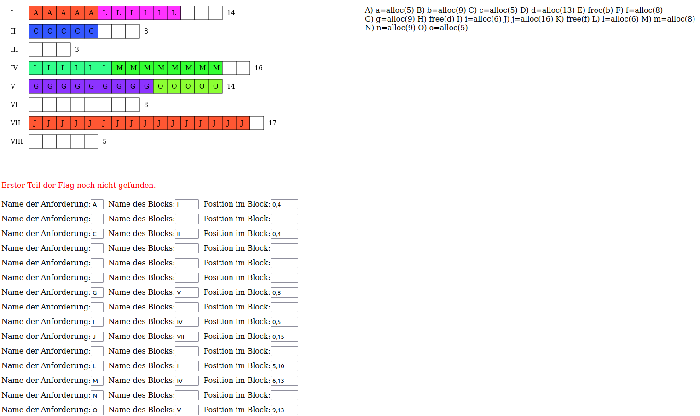

## Next-Fit

Als nächstes kommt Next-Fit dran, das Ergebnis ist bei diesem Beispiel identisch, aber "Das Next-Fit-Verfahren funktioniert wie First-Fit, nur merkt sich das Next-Fit-Verfahren die aktuelle Position und fährt bei der nächsten Suche nach freiem Speicher von dieser Position aus fort."¹

- Wir fangen erst bei I an, da es keine vorherige Position gibt die wir uns gemerkt haben könnten:
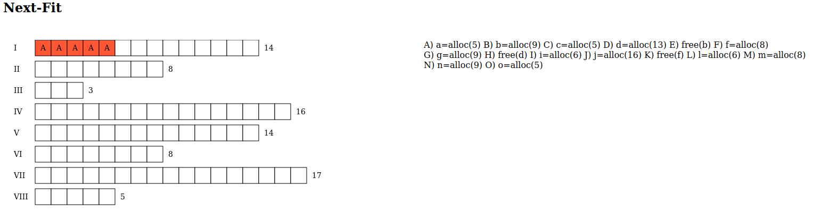

- Wir schauen also von I und finden direkt passenden Platz:
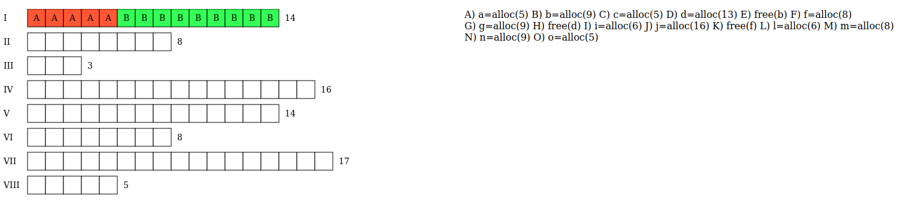

- C muss in II:
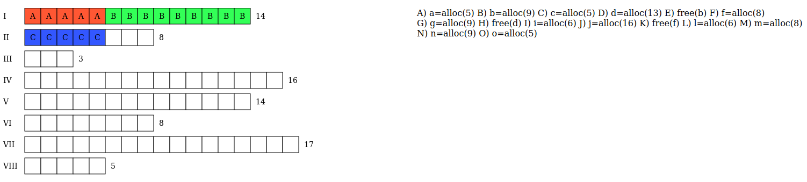

- Wir schauen von II an und finden erst in IV Platz(hier hat D 1 Platz zu viel, dies wird später korrigiert) :
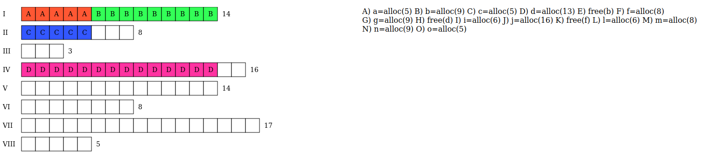

- Jetzt wird B gelöscht und wir schauen für die nächste Operaton wieder ab 
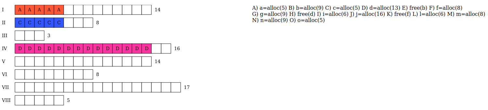

- Leider sind hier Aufzeichnungen verloren gegangen -> F wird in I eingefügt, da wir uns zuletzt in I bewegt haben (free). Dann wird G hinzugefügt, findet aber erst in V Platz:
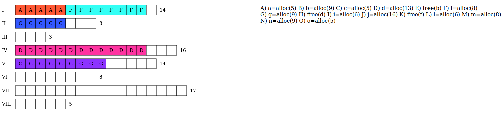

- Die letzte Operation (der acht Operationen) ist H, hier wird lediglich D aus dem Speicher gelöscht.
Unsere Lösung sieht so aus, konnte leider aber auch keine Flag holen:
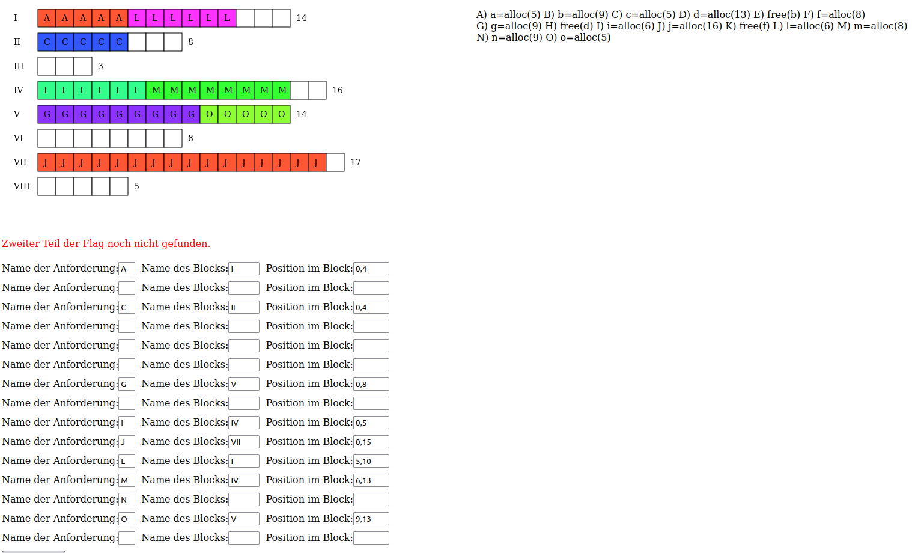

## Zuletzt: Best-Fit
Beim Best-Fit-Verfahren wird die gesamte Speicherliste durchsucht, bis ein kleinstmögliches Loch gefunden wird. Mit diesem Verfahren wird eine optimale Speicherausnutzung garantiert.

- Der erste Eintrag A findet in VIII statt, hier wird der PLatz direkt optimal genutzt:


- B hätte in I oder V landen können, I ist aber an erster Stelle:
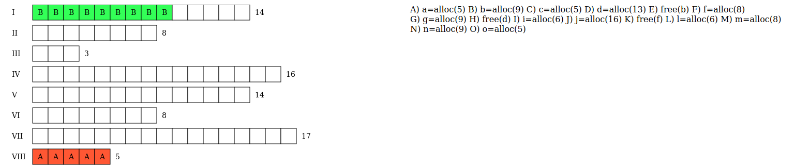

- C landet in I, der Platz wurde optimal genutzt:
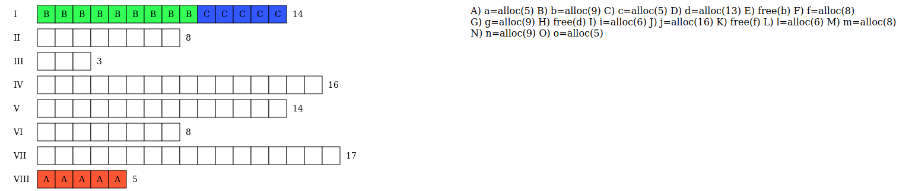

- D kommt jetzt in V:
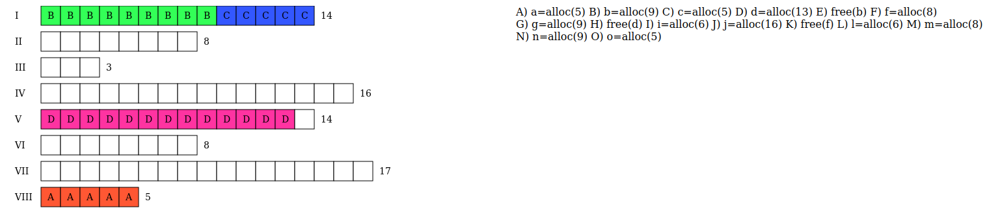

- B wird gelöscht:


- F kommt in II, hätte aber auch optimal in VI gepasst, II ist aber an früherer Stelle:
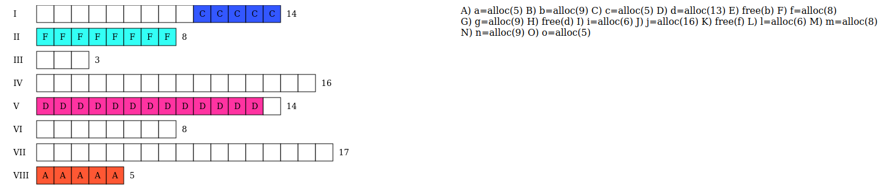

- G füllt optimal den Platz aus, den B vorher belegt hatte:
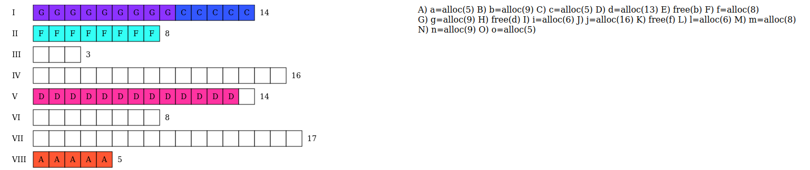

- D wird gelöscht:
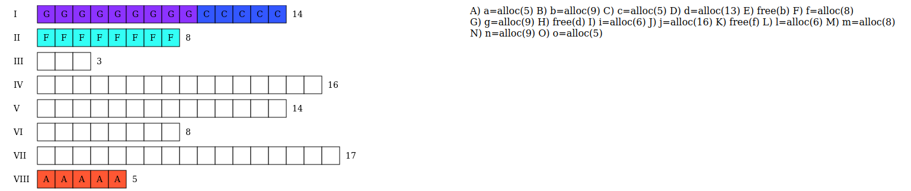

Diese Lösung funktioniert besser als First-Fit oder Next-Fit, zumindest bei unserem Beispiel, da N diesmal nicht verloren gegangen ist, was bei den anderen Methoden allerdings der Fall war:
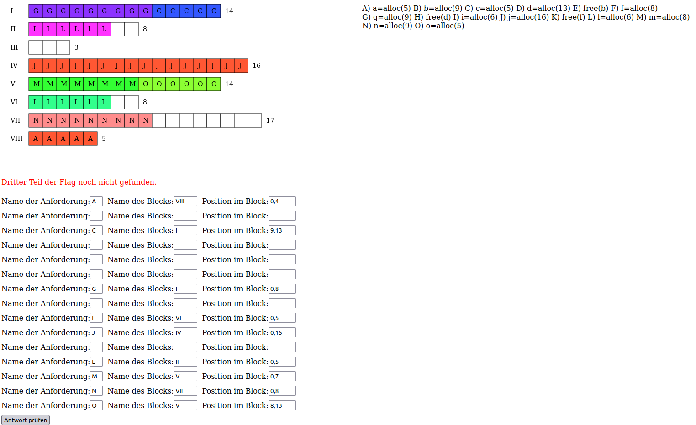

Leider konnten wir auch hier keine Flagge holen.

# Aufgabe 2 & CTF-Challenge „gdb“ – Lösungsdokumentation

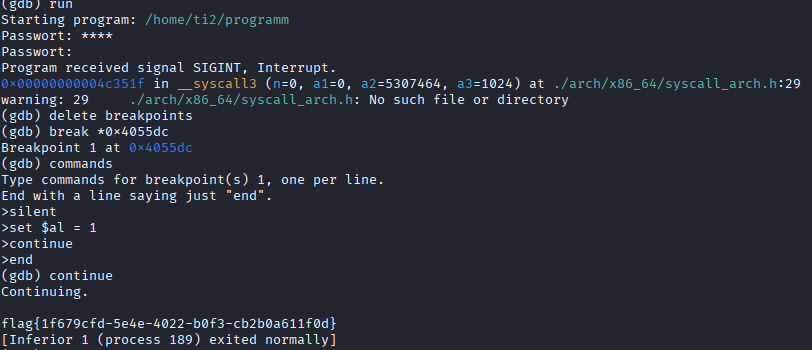

## Überblick

Auf dem bereitgestellten System befand sich eine ausführbare Datei
`programm`, die eine Passwortabfrage implementiert. Die Aufgabe bestand
darin, mithilfe des Debuggers **gdb** die Passwortüberprüfung zu
umgehen, ohne das echte Passwort zu kennen.

Ziel war es, den Programmablauf an einer geeigneten Stelle so zu
manipulieren, dass die Passwortprüfung immer als erfolgreich erkannt
wird.

## 1. Analyse des Programms

Nach dem Starten von gdb wurde die `main`-Funktion disassembliert:

``` gdb
(gdb) set disassembly-flavor intel
(gdb) disas main
```

Im Disassembly findet sich folgender kritischer Abschnitt:

``` asm
0x00000000004055c8 <+283>: call 0x405299 <read_password(...)>
0x00000000004055d7 <+298>: call 0x405063 <checkPassword(...)>
0x00000000004055dc <+303>: test al,al
0x00000000004055de <+305>: je 0x405676 <main+457>
```

Wichtig:

-   Die Funktion `checkPassword()` gibt ihr Ergebnis im Register **AL**
    zurück
    -   `1` → Passwort korrekt
    -   `0` → Passwort falsch
-   Direkt danach erfolgt die Überprüfung über `test al, al`
-   Bei falschem Passwort wird per `je` in den Fehlerzweig gesprungen.

### Ziel

Das Register **AL so manipulieren**, dass es immer den Wert `1`
enthält.\
Dadurch wird das Passwort als korrekt akzeptiert.

## 2. Setzen eines Breakpoints an der Entscheidungsstelle

Der passende Punkt ist die Instruktion:

``` gdb
0x4055dc
```
Hier wird der Rückgabewert geprüft, bevor der Sprung ausgeführt wird.

``` gdb
(gdb) break *0x4055dc
```

### Begründung

-   Breakpoint liegt **nach** dem Funktionsaufruf von `checkPassword()`
-   Breakpoint liegt **vor** der Verzweigung (`je`)
-   An dieser Stelle kann man den Rückgabewert (`al`) sicher
    manipulieren
-   Die gesamte Passwortlogik bleibt unangetastet -- nur die
    Entscheidung wird beeinflusst

## 3. Automatische Manipulation durch Breakpoint-Commands

Nach Setzen des Breakpoints wurden gdb-interne Befehle definiert, die
beim Erreichen des Breakpoints automatisch ausgeführt werden:

``` gdb
(gdb) commands
> silent
> set $al = 1
> continue
> end
```

### Erklärung der Commands

| Befehl | Bedeutung |
|------|---------|
| `silent` | Unterdrückt Ausgaben beim Breakpoint-Hit |
| `set $al = 1` | Setzt Rückgabewert von checkPassword() auf „korrektes Passwort" |
| `continue` | Programm läuft ohne Unterbrechung weiter |

Damit wird jeder Passwortversuch automatisch als korrekt erkannt.

## 4. Ausführen des Programms

Nun wird das Programm einfach gestartet:

``` gdb
(gdb) run
```

Nach Eingabe eines beliebigen Passworts setzt gdb automatisch `al = 1`,
und das Programm zeigt die Flag an:

    flag{1f679cfd-5e4e-4022-b0f3-cb2b0a611f0d}

Das Passwort selbst wird somit vollständig umgangen.

## 5. Ergebnis

Durch das geschickte Setzen eines Breakpoints und Manipulation des
Registers `al` konnte die Passwortabfrage erfolgreich umgangen werden.\
Dies ist eine saubere, reproduzierbare Methode, die exakt an der
Entscheidungsstelle des Programms eingreift und den Kontrollfluss in
gewünschter Weise beeinflusst.


## Literaturverzeichnis

1. https://sourceware.org/gdb/current/onlinedocs/gdb.html/