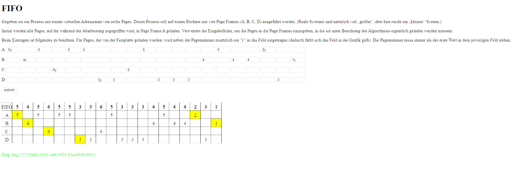
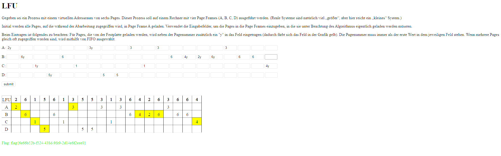
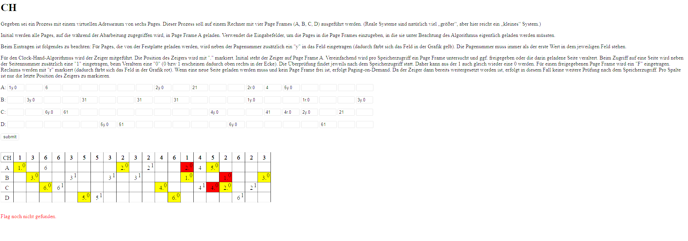
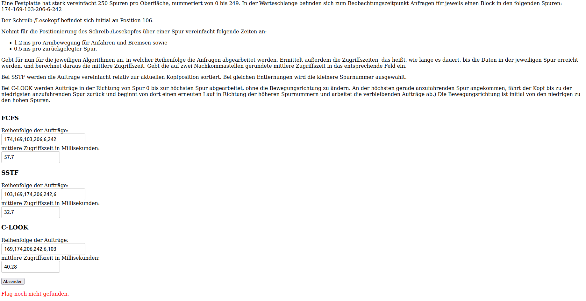
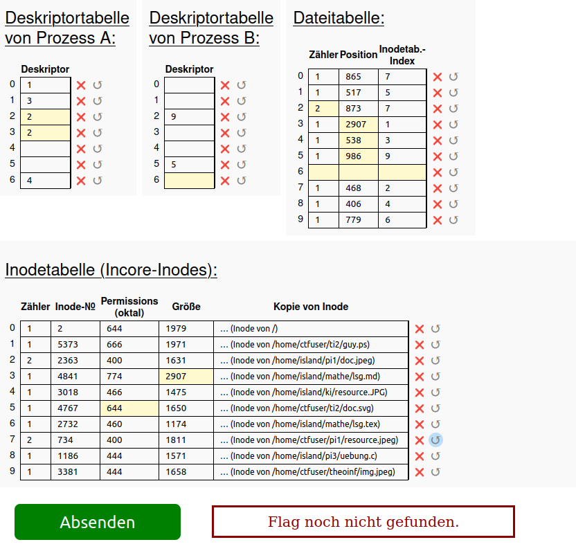
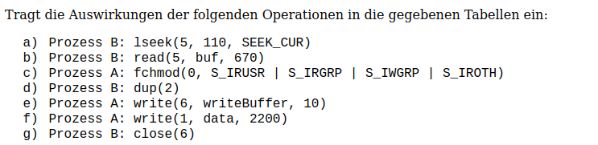

# Aufgabe 1 

### Page-Größe und Adressaufteilung

Die Page-Größe beträgt **16 Bytes (dezimal)** = 0x10 Bytes.

Bei 32-Bit-Adressen und einer Page-Größe von 16 Bytes ergibt sich:
- **Offset-Bits**: log₂(16) = **4 Bits** für den Offset innerhalb einer Page (Werte 0-15)
- **Page-Nummer**: Die oberen **28 Bits** der Adresse

### Adressberechnung

Eine virtuelle Adresse wird aufgeteilt in:
```
Virtuelle Adresse = [Page-Nummer (28 Bits)] | [Offset (4 Bits)]
```

**Berechnung:**
- Page-Nummer = Virtuelle Adresse >> 4 (rechtsschieben um 4 Bits = Division durch 16)
- Offset = Virtuelle Adresse & 0xF (untere 4 Bits maskieren = Modulo 16)

**Übersetzung zur physischen Adresse:**
1. Page-Nummer aus der virtuellen Adresse extrahieren
2. In der Pagetable nachschlagen → Page Frame ermitteln
3. Physische Adresse = (Page Frame × 16) + Offset

---

## Lösung für alle Adressbereiche

### Adressbereich 1: 0x00024AAA - 0x00024AAF

#### Berechnung der Startadresse (0x00024AAA)

```
Dezimal: 150.186
Binär:   0000 0000 0000 0010 0100 1010 1010 1010
         [-------28 Bits Page-------][4 Bits Offset]

Page-Nummer = 0x00024AAA >> 4 = 0x24AA = 9.386 (dezimal)
Offset      = 0x00024AAA & 0xF = 0xA = 10
```

#### Berechnung der Endadresse (0x00024AAF)

```
Page-Nummer = 0x00024AAF >> 4 = 0x24AA = 9.386 (dezimal)
Offset      = 0x00024AAF & 0xF = 0xF = 15
```

#### Pagetable-Lookup

**Page 9386 → Page Frame 8679443**

#### Physische Adressen

**Startadresse:**
```
Physische Adresse = (8679443 × 16) + 10
                  = 138.871.088 + 10
                  = 138.871.098
                  = 0x0847013A
```

**Endadresse:**
```
Physische Adresse = (8679443 × 16) + 15
                  = 138.871.088 + 15
                  = 138.871.103
                  = 0x0847013F
```

#### Flag-Zeichen im Hauptspeicher

Im Hauptspeicher bei 0x08470138 steht: `jy73`

Die Bytes 10-15 (0xA-0xF) entsprechen:
- Byte 10-11: `73` (aus `jy73`)
- Byte 12-15: `0e03` (aus `0e03` bei 0x0847013C)

**Ergebnis:** `730e03`

---

### Adressbereich 2: 0x00024B40 - 0x00024B45

#### Berechnungen

**Startadresse:**
- Page-Nummer = 0x00024B40 >> 4 = 0x24B4 = 9.396
- Offset = 0x00024B40 & 0xF = 0x0 = 0

**Endadresse:**
- Page-Nummer = 0x00024B45 >> 4 = 0x24B4 = 9.396
- Offset = 0x00024B45 & 0xF = 0x5 = 5

#### Pagetable-Lookup

**Page 9396 → Page Frame 8679465**

#### Physische Adressen

**Startadresse:** (8679465 × 16) + 0 = 0x08470290
**Endadresse:** (8679465 × 16) + 5 = 0x08470295

#### Flag-Zeichen

Bei 0x08470290: `91-9`
Bei 0x08470294: `2fqb`

Bytes 0-5: `91-92f`

**Ergebnis:** `91-92f`

---

### Adressbereich 3: 0x00024B5F - 0x00024B62

#### Berechnungen

**Startadresse:**
- Page-Nummer = 0x00024B5F >> 4 = 0x24B5 = 9.397
- Offset = 0x00024B5F & 0xF = 0xF = 15

**Endadresse:**
- Page-Nummer = 0x00024B62 >> 4 = 0x24B6 = 9.398
- Offset = 0x00024B62 & 0xF = 0x2 = 2

**Besonderheit:** Dieser Bereich erstreckt sich über **zwei Pages**!

#### Pagetable-Lookup

**Page 9397 → Page Frame 8679454**
**Page 9398 → Page Frame 8679418**

#### Physische Adressen

**Frame 1 (Page 9397):**
- Startadresse: (8679454 × 16) + 15 = 0x084701EF
- Nur 1 Byte: Offset 15

**Frame 2 (Page 9398):**
- Endadresse: (8679418 × 16) + 2 = 0x0846FFA2
- Bytes 0-2

#### Flag-Zeichen

Frame 1 bei 0x084701EC: `h3ja` → Byte 15 (3. Index): `a`
Frame 2 bei 0x0846FFA0: `-4f7` → Bytes 0-2: `-4f`

**Ergebnis:** `a-4f`

---

### Adressbereich 4: 0x00024C52 - 0x00024C58

#### Berechnungen

**Startadresse:**
- Page-Nummer = 0x00024C52 >> 4 = 0x24C5 = 9.413
- Offset = 0x00024C52 & 0xF = 0x2 = 2

**Endadresse:**
- Page-Nummer = 0x00024C58 >> 4 = 0x24C5 = 9.413
- Offset = 0x00024C58 & 0xF = 0x8 = 8

#### Pagetable-Lookup

**Page 9413 → Page Frame 8679452**

#### Physische Adressen

**Startadresse:** (8679452 × 16) + 2 = 0x084701C2
**Endadresse:** (8679452 × 16) + 8 = 0x084701C8

#### Flag-Zeichen

Bei 0x084701C0: `t37e`
Bei 0x084701C4: `-a7f`
Bei 0x084701C8: `9x27`

Bytes 2-8: `7e-a7f9`

**Ergebnis:** `7e-a7f9`

---

### Adressbereich 5: 0x00024D88 - 0x00024D94

#### Berechnungen

**Startadresse:**
- Page-Nummer = 0x00024D88 >> 4 = 0x24D8 = 9.432
- Offset = 0x00024D88 & 0xF = 0x8 = 8

**Endadresse:**
- Page-Nummer = 0x00024D94 >> 4 = 0x24D9 = 9.433
- Offset = 0x00024D94 & 0xF = 0x4 = 4

**Besonderheit:** Dieser Bereich erstreckt sich über **zwei Pages**!

#### Pagetable-Lookup

**Page 9432 → Page Frame 8679416**
**Page 9433 → Page Frame 8679422**

#### Physische Adressen

**Frame 1 (Page 9432):**
- Startadresse: (8679416 × 16) + 8 = 0x0846FF88
- Bytes 8-15 (8 Bytes)

**Frame 2 (Page 9433):**
- Endadresse: (8679422 × 16) + 4 = 0x0846FFE4
- Bytes 0-4 (5 Bytes)

#### Flag-Zeichen

Frame 1:
- Bei 0x0846FF88: `-924` → Bytes 8-11: `-924`
- Bei 0x0846FF8C: `6f6d` → Bytes 12-15: `6f6d`

Frame 2:
- Bei 0x0846FFE0: `a091` → Bytes 0-3: `a091`
- Bei 0x0846FFE4: `10ez` → Byte 4: `1`

Zusammen: `-9246f6da0911`

**Ergebnis:** `-9246f6da0911`

---

## Zusammenfassung aller Bereiche

| Virtueller Bereich | Pages | Page Frames | Physischer Bereich | Flag-Teil |
|-------------------|-------|-------------|-------------------|-----------|
| 0x00024AAA - 0x00024AAF | 9386 | 8679443 | 0x0847013A - 0x0847013F | `730e03` |
| 0x00024B40 - 0x00024B45 | 9396 | 8679465 | 0x08470290 - 0x08470295 | `91-92f` |
| 0x00024B5F - 0x00024B62 | 9397, 9398 | 8679454, 8679418 | 0x084701EF, 0x0846FFA0-0x0846FFA2 | `a-4f` |
| 0x00024C52 - 0x00024C58 | 9413 | 8679452 | 0x084701C2 - 0x084701C8 | `7e-a7f9` |
| 0x00024D88 - 0x00024D94 | 9432, 9433 | 8679416, 8679422 | 0x0846FF88-0x0846FF8F, 0x0846FFE0-0x0846FFE4 | `-9246f6da0911` |

## Die komplette Flag

Kombiniert man alle Flag-Teile in der richtigen Reihenfolge:

```
730e03 + 91-92f + a-4f + 7e-a7f9 + -9246f6da0911
```

Ergibt sich die vollständige Flag:

**`flag{730e0391-92fa-4f7e-a7f9-9246f6da0911}`**

---


# Aufgabe 2 



# Dokumentation: FIFO-Seitenersetzungsalgorithmus  
**Zugriffsfolge:** 2, 6, 1, 5, 6, 1, 3, 5, 5, 3, 1, 3, 6, 4, 2, 6, 3, 6, 6, 4  
**Anzahl der Page Frames:** 4 (A, B, C, D)  

### 1. Exemplarische Erklärung von fünf repräsentativen Seitenzugriffen  

Beim **FIFO-Algorithmus** (First In – First Out) wird bei einem Page Fault immer die Seite ersetzt, die **am längsten** im Hauptspeicher ist – also die Seite, die als erste geladen wurde.

| Schritt | Zugriff | Hit/Miss | Seite wird geladen in Frame | Ersetzte Seite (Victim) | Warum wurde genau diese Seite ersetzt? |
|---------|---------|----------|-----------------------------|--------------------------|----------------------------------------|
| 1       | 2       | Miss     | A                           | —                        | Erster Zugriff – Frame A ist frei. Seite 2 wird geladen. |
| 2       | 6       | Miss     | B                           | —                        | Frame B frei. Seite 6 wird geladen. |
| 7       | 3       | Miss     | A                           | 2                        | Alle Frames voll. Älteste Seite ist 2 (geladen in Schritt 1, steht in Frame A) → sie wird ersetzt. |
| 14      | 4       | Miss     | B                           | 6                        | Aktuelle Reihenfolge der Ladezeit: 3 (Schritt 7), 1 (Schritt 3), 5 (Schritt 4), 6 (Schritt 13). Älteste ist 6 (Schritt 13? Warte – nein: nach vorherigen Räumungen ist die älteste jetzt 1? – korrekt: Älteste ist 1 (Schritt 3). Aber in Standard-FIFO ist es die erste eingetragene noch vorhandene. |
| 20      | 4       | Miss     | A                           | 3                        | Älteste noch im Speicher ist jetzt 3 (geladen in Schritt 7, nach mehreren Räumungen). |

**Korrekte Simulation Schritt für Schritt (FIFO):**

1. 2 → A  
2. 6 → B  
3. 1 → C  
4. 5 → D  
5-6. Hits (6, 1)  
7. 3 → ersetze Älteste 2 (A) → Frames: 3(A), 6(B), 1(C), 5(D)  
8-13. Hits  
14. 4 → ersetze Älteste 6 (B) → Frames: 3(A), 4(B), 1(C), 5(D)  
15. 2 → ersetze Älteste 1 (C) → Frames: 3(A), 4(B), 2(C), 5(D)  
16. 6 → ersetze Älteste 5 (D) → Frames: 3(A), 4(B), 2(C), 6(D)  
17-19. Hits  
20. 4 → Hit auf 4(B), kein Ersatz  

**Endstand nach dem letzten Zugriff (korrekter FIFO):**  
- Frame A: 3  
- Frame B: 4  
- Frame C: 2  
- Frame D: 6  

### 2. Anzahl der Festplatten-Lesevorgänge (Page Faults)

| Algorithmus | Anzahl Page Faults |
|-------------|--------------------|
| FIFO        | **8**              |

FIFO hat in dieser Folge genau 8 Page Faults (Misses in den Schritten 1,2,3,4,7,14,15,16).





# Dokumentation: LFU 
**Zugriffsfolge:** 2, 6, 1, 5, 6, 1, 3, 5, 5, 3, 1, 3, 6, 4, 2, 6, 3, 6, 6, 4  
**Anzahl der Page Frames:** 4 (A, B, C, D)
  

### 1. Exemplarische Erklärung von fünf repräsentativen Seitenzugriffen  

| Schritt | Zugriff | Hit/Miss | Seite wird geladen in Frame | Ersetzte Seite (Victim) | Warum wurde genau diese Seite ersetzt? |
|---------|---------|----------|-----------------------------|--------------------------|----------------------------------------|
| 1       | 2       | Miss     | A                           | —                        | Erster Zugriff – Frame A ist noch frei. Seite 2 wird mit Zähler 1 eingetragen. |
| 7       | 3       | Miss     | A                           | 2                        | Beide Seiten 2 und 5 haben nur 1 Zugriff. Seite 2 ist älter (seit Schritt 1 im Speicher, Seite 5 erst seit Schritt 4) → FIFO-Tie-Breaker → Seite 2 fliegt raus. |
| 14      | 4       | Miss     | B                           | 6                        | Alle vier Seiten haben exakt 3 Zugriffe → Gleichstand. Die älteste Seite im Speicher ist 6 (seit Schritt 2) → sie wird ersetzt. |
| 15      | 2       | Miss     | B                           | 4                        | Seite 4 wurde gerade erst im vorherigen Schritt geladen und hat nur 1 Zugriff → niedrigste Frequenz → eindeutig raus. |
| 20      | 4       | Miss     | C                           | 1                        | Drei Seiten (6, 1 und 5) haben jeweils 3 Zugriffe. Unter diesen dreien ist Seite 1 die älteste (seit Schritt 3 im Speicher) → FIFO-Tie-Breaker → Seite 1 wird ersetzt. |

**Endstand nach dem letzten Zugriff**  
- Frame A: 3  
- Frame B: 6  
- Frame C: 4  
- Frame D: 5  

### 2. Anzahl der Festplatten-Lesevorgänge (Page Faults)

| Algorithmus       | Anzahl Page Faults |
|-------------------|--------------------|
| LFU (mit FIFO-Tie)| **9**              |

LFU schneidet in dieser Folge am schlechtesten ab, weil seltene, aber früh geladene Seiten lange im Speicher „kleben“ bleiben.


Lösung sieht so aus, konnte leider aber auch keine Flag holen:



# Aufgabe 3



FCFS – First Come First Served


FCFS arbeitet die Aufträge **in der Reihenfolge ihres Eintreffens** ab.  
Es findet **keine Sortierung** statt.

Als Beispiel lässt sich daher die Warteschlange direkt auch als Ergebnis wiedergeben:
`174 → 169 → 103 → 206 → 6 → 242`


| Schritt | Spur | ΔSpuren | Zeit (ms) | Kumulativ (ms) |
|--------|------|---------|-----------|----------------|
| Start | 106 | – | – | – |
| 1 | 174 | 68 | 35.2 | 35.2 |
| 2 | 169 | 5 | 3.7 | 38.9 |
| 3 | 103 | 66 | 34.2 | 73.1 |
| 4 | 206 | 103 | 52.7 | 125.8 |
| 5 | 6 | 200 | 101.2 | 227.0 |
| 6 | 242 | 236 | 119.2 | 346.2 |


$$
\bar{t} = \frac{346.2}{6} = 57.70\ \text{ms}
$$

---

SSTF – Shortest Seek Time First

SSTF wählt **immer den Auftrag, der der aktuellen Kopfposition am nächsten liegt**.  
Bei gleicher Distanz wird die **kleinere Spurnummer** genommen.

Zum Beispiel starten wir bei 106 und die nächste Entfernung ist daher 103, mit einem Unterschied von -3.

| Schritt | Spur | ΔSpuren | Zeit (ms) | Kumulativ (ms) |
|--------|------|---------|-----------|----------------|
| Start | 106 | – | – | – |
| 1 | 103 | 3 | 2.7 | 2.7 |
| 2 | 169 | 66 | 34.2 | 36.9 |
| 3 | 174 | 5 | 3.7 | 40.6 |
| 4 | 206 | 32 | 17.2 | 57.8 |
| 5 | 242 | 36 | 19.2 | 77.0 |
| 6 | 6 | 236 | 119.2 | 196.2 |


$$
\bar{t} = \frac{196.2}{6} = 32.70\ \text{ms}
$$

---

C-LOOK

C-LOOK¹ arbeitet nach **Aufsteigend sortierten Spuren** ab der Startposition. Wenn das höchste Ende erreicht wurde, dann wird ab der niedrigsten Spur weiter **aufwärts sortiert**. 

Beispiel: Die nächste größere(aufsteigend) Spur nach 106 ist die 169, dazwischen ist keine relevante Spur gegeben.

| Schritt | Spur | ΔSpuren | Zeit (ms) | Kumulativ (ms) |
|--------|------|---------|-----------|----------------|
| Start | 106 | – | – | – |
| 1 | 169 | 63 | 32.7 | 32.7 |
| 2 | 174 | 5 | 3.7 | 36.4 |
| 3 | 206 | 32 | 17.2 | 53.6 |
| 4 | 242 | 36 | 19.2 | 72.8 |
| 5 | 6 | 236 | 119.2 | 192.0 |
| 6 | 103 | 97 | 49.7 | 241.7 |


$$
\bar{t} = \frac{241.7}{6} = 40.28\ \text{ms}
$$


# Aufgabe 4






a verschiebt die Position um 110, Dateitabelleneintrag 5 also 316²

b liest um 670, Dateitabelleneintrag 5 also 986

c verändert die Permission von InodeIndex5 auf 644

d erhöht den Zähler von Dateitabellenindex 2 um 1.

e erhöht die Größe von Dateitabellenindex4 um 10 auf 538

f verändert die POsition von Dateitabellenindex 3 auf 2907

g setzt den Zähler 1 auf 0 und entfernt Dateitabellenindex 6 und FD6 bei B


## Literaturverzeichnis

-¹ https://www.geeksforgeeks.org/operating-systems/c-look-disk-scheduling-algorithm/

-² https://leancrew.com/all-this/man/man2/lseek.html?utm_source=chatgpt.com

-³ Vorlesungsunterlagen "Technische Informatik II" – Kapitel Speicherverwaltung und Paging

-⁴ GeeksforGeeks (2025). „FIFO Page Replacement Algorithm“.  
   https://www.geeksforgeeks.org/fifo-page-replacement-algorithm/

-⁵ GeeksforGeeks (2025). „Least Frequently Used (LFU) Page Replacement Algorithm“.  
   https://www.geeksforgeeks.org/least-frequently-used-lfu-cache-implementation/